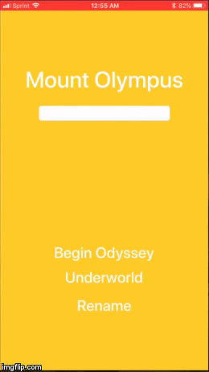

## Greek Gods

### App Description
    This is a simple app that is Greek Mythology themed

### App Walk-though

### Required User Stories
    - [x] 1. User sees custom text in a label 
    - [x] 2. User see's custom background color.
    - [x] 3. User can tap a button to change the text color of the label.

### Optional User Stories
    - [x] 1. User can tap a button to change the color of the background view.
    - [x] 2. User can tap a button to change the text string of the label - Mount Othrys.
    - [x] 3. User can tap on the background view to reset all views to default settings.
    - [x] 4. User can update the label text with custom text entered into the text field.
    - [x] a. User can enter text into a text field using the keyboard.
    - [ ] b. User can tap the "Change text string" button to update the label with the text from the text field.
    - [x] c. If the text field is empty, update label with alternate string - Mount Othrys.
    - [x] d. The keyboard is dismissed after touching the empty space (view).
    
### Notes
    - I do not know why, but the main label automatically changes to whatever is typed into the 
      textField without the Rename button being pressed
    - While testing the app, I could not get the keyboard to go away so I decided to add code that dismissed the 
      keyboard when you touch the view (reset).
    - I had extreme trouble running the simulator, and I never got it to work. Instead, I had to
      run/test the app on my phone. This led to some complications while making the app 
      walkthrough gif.
    - The "Underworld" button that changes the background view also changes the color of two of the other buttons,
      but I could not get it to change the color of the "Underworld" button and I do not know why.
    - In an effort to show all of the features in the least time possible, the gif seems slightly rushed.
    
